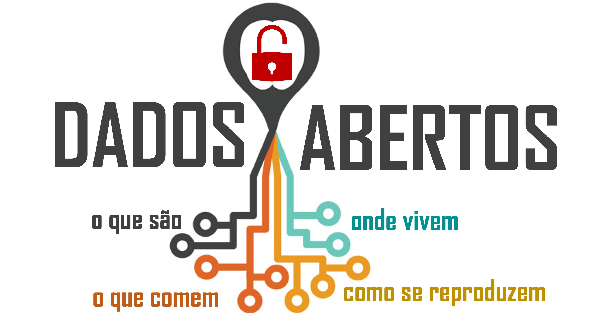

```{r setup, include=FALSE}

knitr::opts_chunk$set(echo = T, warning = F, fig.align = "center", message = F, error = F, cache = TRUE)
```

{width="526"}

No dia 19 de julho de 2022, eu dei uma palestra híbrida (com platéia e transmitida ao vivo) no [EcoEncontros](https://ecoencontros.ib.usp.br/pt/), o ciclo de seminários do Programa de Pós-Graduação em Ecologia da USP. A palestra teve boa repercussão, gerou bastante discussão mesmo depois da gravação!

Então para não perdê-la de vista, vou deixar aqui nesta página o link para o PDF da apresentação no Zenodo e o video gravado no YouTube:

-   [Slides em PDF](https://zenodo.org/record/6861029) com links para as referências mencionadas.

-   [Vídeo YouTube](https://www.youtube.com/watch?v=5OLUxXQ7gqw). Note que a partir do minuto 25 o áudio fica um pouco instável por conta do microfone da câmera, mas ainda dá para acompanhar a apresentação.

Espero que gostem!!

### Resumo da palestra:

Dados são centrais na pesquisa ecológica, ainda assim, o treinamento de nós - cientistas em formação - em organização, gestão e publicação de dados é pouco valorizado. O resultado é frustração, tempo perdido, gambiarras e altas chances de perda de parte (senão todo) dos dados! Além disso, dados abertos têm se tornado um tema muito debatido com o movimento crescente da "Ciência Aberta". Agências de fomento e revistas científicas têm exigido planos de gestão e declarações sobre disponibilidade dos dados.

Nesta palestra, compartilharei o que tenho aprendido no universo dos dados: desde seu planejamento, organização até a publicação. Trago algumas ferramentas e práticas em gestão e publicação de dados, levantando a discussão de boas práticas e tendências que facilitem e valorizem nossas pesquisas e preciosos dados!
