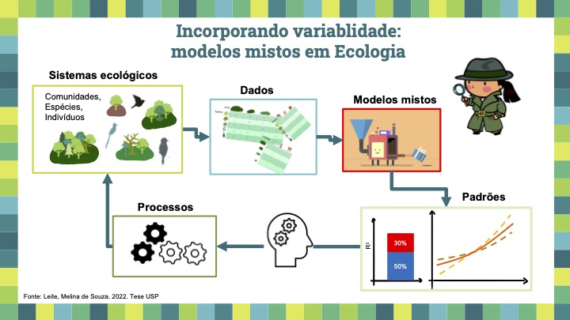
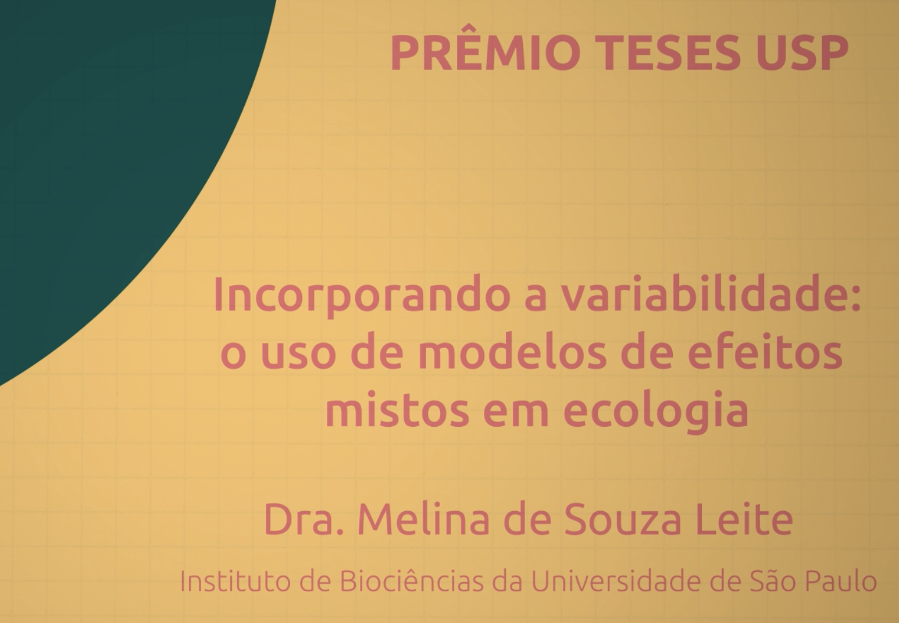

Olá pessoal!

Já estamos em 2025 e só agora consegui autorização da USP para divulgar o vídeo que eu fiz sobre a minha tese defendida em dezembro de 2022! A tese, junto com o vídeo de divulgação, ganharam o prêmio [Teses Destaque USP 2023](https://jornal.usp.br/institucional/pro-reitoria-de-pos-graduacao-divulga-vencedores-do-premio-tese-destaque-usp/).

Já faz um bom tempo, mas nunca é tarde para divulgar esse material do qual me orgulho muito!

[Aqui está o link]() para o vídeo no YouTube.

[{width="500"}](https://www.youtube.com/watch?v=AWsvBHIzrOM)

Esse vídeo foi produzido pelo querido e muito habilidoso [Marcelo K Sato (caramelo)](http://alociencia.com.br/sobre/).

Agradecimentos aos meus colaboradores e co-orientadores e especial agradecimento ao meu grande mentor e orientador [Paulo Inácio Prado](https://ecologia.ib.usp.br/let/doku.php?id=let)!!

Aqui estão os links para os artigos derivados da tese que eu menciono no vídeo:\
\
- <https://doi.org/10.1111/1365-2664.14275>\
\
- <https://nsojournals.onlinelibrary.wiley.com/doi/10.1111/ecog.07187>

Espero que gostem! :)
